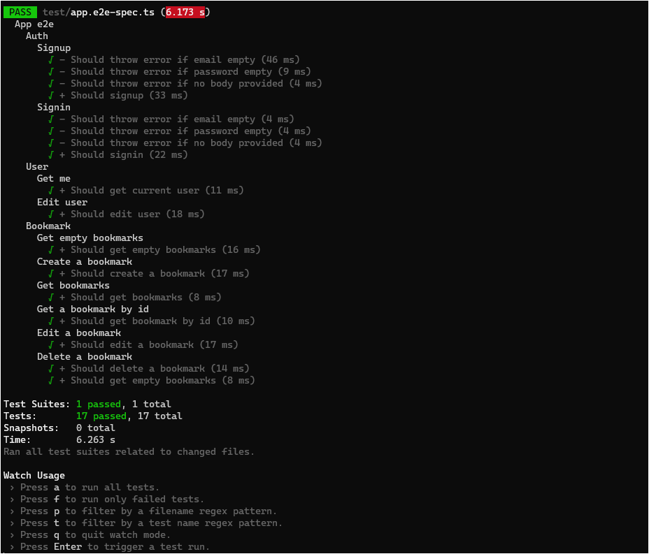

## Description
A bookmarking app.  
*Training resources from freeCodeCamp.org*  
*[NestJs Course for Beginners - Create a REST API](https://www.youtube.com/watch?v=GHTA143_b-s)*
## Installation

```bash
$ npm install
```

## Running the app

```bash
$ npm run db:dev:restart
$ npm run start:dev
```

## Test

```bash
# e2e tests
$ npm run test:e2e
```

## Stack

- Argon2
- Docker
- NestJS
- PactumJS
- Passport.js (JWT)
- Postgres
- Prisma

## Screenshot

